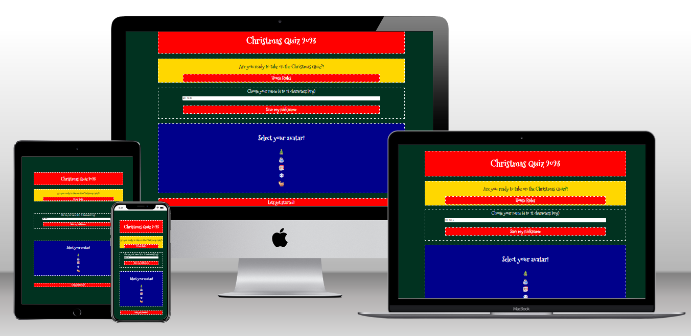

# The Christmas Quiz

#### **By Ffion Haf Edwards**
[Click here to view the live web application](https://ffionhaf96.github.io/msp-2-christmas-quiz/index.html)

This is the documentation for my web application: The Christmas Quiz. It has been built using HTML5, CSS3 & JavaScript for educational purposes as part of Code Institute’s Diploma in Web Application Development Course.

- - -

## Table of Contents
1. [Project Development & Planning](#project-development--planning)
    * [Project Goals](#project-goals)
    * [Research](#research)
    * [User Stories](#user-stories)
    * [Content](#content)
    * [Design, Layout & Structure](#design-layout--structure)
2. [Technologies Used](#technologies-used)
3. [Features](#features)
4. [JavaScript Functionality](#javascript-functionality)
5. [Testing & Bugs](#testing--bugs)
6. [Deployment](#deployment)
7. [Credits](#credits)
- - -
## Project Development & Planning
The development of "The Christmas Quiz" was a meticulous process guided by the principles of UX design, including the 5 planes of Strategy, Scope, Structure, Skeleton & Surface. Each stage was carefully executed to create an application that is not only engaging and fun but also intuitive and accessible, fulfilling the needs and expectations of both users and clients.

### Project Goals

#### **Project Purpose**
The Christmas Quiz is a multifaceted project with the primary aim of blending education with entertainment. It provides a unique platform for users to enjoy a festive experience while serving as a testament to the practical application of web development skills learned through the Code Institute's course. The project is a harmonious fusion of engaging content, educational value, and user-centric design, catering to a wide range of users while fulfilling specific educational objectives.

#### **Client Goals**
Although "The Christmas Quiz" was developed as a milestone project for my Diploma in Web Application Development at [Code Institute](https://codeinstitute.net/), focusing on interactive frontend development and marking my first foray into JavaScript, it did not have a specific external client. To enhance the professionalism of the project and establish a clear scope, I envisioned it as a real-world application that could be ideally suited for festive season promotions, possibly by a family entertainment center, holiday event organizer, or a Christmas-themed website. The hypothetical client's goals would include:
* Engaging users with interactive and enjoyable content related to the Christmas season.
* Educating users about various Christmas traditions, history, and fun facts through an interactive quiz format.
* Enhancing the festive experience of their website visitors, contributing to the holiday spirit.
* Providing a platform that could potentially be used for festive marketing or promotional activities, attracting a wide audience during the holiday season.

#### **User Goals**

The primary audience for "The Christmas Quiz" includes individuals and families who are interested in festive entertainment and eager to learn about Christmas traditions, history, and trivia. This quiz is designed to appeal to a broad range of users, from children to adults, who wish to engage in holiday spirit in an interactive and educational manner. User Goals are:

- **Enhancing Knowledge**: Users aim to increase their understanding of Christmas traditions, history, and interesting facts from various cultures.
- **Fun and Engagement**: The quiz offers a delightful and engaging experience, contributing to users' festive celebrations.
- **Discovering Lesser-Known Facts**: It provides an opportunity to learn about intriguing and lesser-known aspects of Christmas, enriching their holiday experience.
- **Holiday Spirit**: The quiz is a medium to experience joy and festive spirit through an accessible and entertaining digital platform.

- - -
### Research

#### **Market Review**
The online festive quiz market is diverse and engaging, catering to a wide range of audiences. Kahoot!'s Christmas Trivia Puzzle blends education with festive fun, attracting educators and families. BuzzFeed's Christmas quizzes focus on pop culture, appealing to younger audiences like Millennials and Gen Z. Sporcle offers a broad range of Christmas-themed trivia, attracting general trivia enthusiasts. JetPunk introduces a competitive edge with timed Christmas quizzes, ideal for those who enjoy a challenge. Lastly, Playbuzz's Christmas personality quizzes offer a personalized, light-hearted experience, appealing to individuals seeking fun insights into their personalities.

[Kahoot! Christmas Trivia Puzzle](https://embed.kahoot.it/fa8f4275-b91d-4866-9505-baf3ef95f52f)
[BuzzFeed Christmas Trivia Quizzes](https://www.buzzfeed.com/au/tag/christmas-quiz)
[Sporcle Christmas Quizzes](https://www.sporcle.com/games/subcategory/christmas)
[JetPunk Christmas Quizzes](https://www.jetpunk.com/tags/christmas)
[Playbuzz Christmas Personality Quizzes](https://www.playbuzz.com/quizzes/christmas)

#### **Key Takeaways from Market Review**

* Educational content combined with festive themes is popular (Kahoot!).
* Pop culture and trivia quizzes attract younger audiences (BuzzFeed).
* A broad range of topics in quizzes appeals to a wide audience (Sporcle).
* Timed challenges add a competitive aspect to quizzes (JetPunk).
* Personalized quizzes provide a unique and engaging user experience (Playbuzz).

- - -
### User Stories
In light of the research and defined goals for "The Christmas Quiz," I crafted a set of user stories to guide the development process. Considering the nature of the quiz, it's anticipated that users will engage with it mainly during the festive season.The focus is on providing a delightful first-time experience, with the understanding that some users may revisit for fun or to share with friends and family. The user stories are oriented towards a user engaging with the quiz for the first time or as part of a seasonal activity.

- **User Story 1) Discover Festive Knowledge:** I want to participate in an enjoyable online quiz to learn about Christmas traditions, history, and fun facts from around the world.
- **User Story 2) Engaging Visual Content:** I want to see festive-themed images and graphics that enhance my quiz experience and bring the Christmas spirit to life.
- **User Story 3) Understanding Quiz Results:** I want to see a summary of my quiz results to gain insights into what my answers reveal about my knowledge and preferences regarding Christmas.
- **User Story 4) Multi-Device Accessibility:** I want to access the quiz on any device, whether it's my desktop, tablet, or smartphone, ensuring a seamless experience.
- **User Story 5) Ease of Navigation:** I want to navigate the site easily, finding my way through the quiz and any additional festive content without any confusion or difficulty.

- - -
### Content

The Christmas Quiz offers a merry foray into the world of holiday trivia with 10 multiple-choice questions, each designed to test your general knowledge of all things Christmas. This festive quiz covers a wide range of yuletide topics, from historical tidbits and global traditions to famous characters and seasonal stories, without focusing on specific categories.

As you answer each question, your Christmas savvy is calculated and then presented as a percentage score on the results page. This score is a lighthearted way to gauge your Christmas cheer and knowledge, transforming your correct answers into a festive fun rating.

The quiz culminates in a results page that celebrates your Christmas spirit based on your percentage score. Whether you're a Christmas novice or a seasoned pro, the quiz provides suggestions and festive insights tailored to your results. Score lower, and you might be encouraged to explore more about Christmas through films, music, or recipes. A higher score might suggest you're the go-to person for holiday trivia or could even challenge you to share and spread your extensive Christmas knowledge.

The Christmas Quiz is all about celebrating the holiday season through an engaging, trivia-filled journey. It's designed purely for entertainment, aiming to spread joy and a bit of competitive spirit. So, gather your friends and family, test your festive know-how, and see who can claim the title of Christmas Champion!

- - -
### Design, Layout & Structure
#### **Wireframes**

I chose to create detailed wireframes for "The Christmas Quiz" using diagrams.net, focusing on the structure, skeleton, and layout, as well as the overall style and appearance of the site. This approach allowed me to make critical design decisions regarding colors, fonts, and layout before starting the coding process. The wireframes were developed for desktop, tablet, and mobile views to ensure that responsiveness was a key consideration from the start.

Welcome Screen

The welcome screen wireframe illustrates the initial user interface, with festive design elements and a start button to engage users.

House Rules Modal

The house rules modal will sit ontop of the welcome screen when the "house rules" button is pressed to show the user expected ettiqute and remind them to have some spirited Christmas fun.

Quiz Interface

This wireframe shows the quiz layout, including the question and answer options, designed to be user-friendly and visually appealing.

Results Screen

The results screen wireframe displays how users' festive profiles and suggestions will be presented at the end of the quiz.

These wireframes served as a blueprint throughout the development process, ensuring that the final product was aligned with the initial design vision and fully responsive across all devices.

- - -
#### **Structure**

The structure of "The Christmas Quiz" website is meticulously designed, considering the scope, user and business goals, as well as adhering to the principles of Interaction Design (IXD) to ensure an intuitive user experience.

The site maintains a straightforward structure, with all content, except for a custom 404 error page, contained within a single web page (index.html). The content dynamically changes via JavaScript based on the user's interaction with the quiz. The main divisions within the page that appear and disappear at different stages of the quiz are:

**Welcome:** This section provides a warm introduction with festive visuals. It features a start button that launches the quiz, setting the tone for a fun and engaging Christmas-themed experience.

**House Rules:** This section provides users with clear and concise instructions on how to play the quiz.

**Quiz:** The core gameplay area includes a progress indicator, the quiz question, multiple-choice answer options, and a 'restart quiz' button for users wishing to play again.

**Results:** Here, users see a summary of their quiz performance, presented in an engaging format such as festive-themed graphics or text descriptions. This section might also include personalized Christmas activity or recipe suggestions based on their answers. Additionally, there's an option to return to the start for those who want to take the quiz again.

There's also a custom 404 error page designed to handle instances where a user lands on a non-existent page. This page includes a link back to index.html, allowing users to easily navigate back to the quiz.

Both the main index.html page and the 404 page feature a non-clickable logo at the top to prevent accidental restarts of the quiz and a footer, including social media links.

- - -
#### **Colour & Design**

The Christmas Quiz web application is designed to offer an immersive and festive user experience. The colour palette and design elements are carefully chosen to evoke the warmth and joy of the holiday season, ensuring that users feel the Christmas spirit while interacting with the app.

##### **Colour Palette**

I have selected a vibrant and harmonious colour palette that combines traditional Christmas colors with a touch of elegance and winter charm:

    Classic Red (rgba(255, 0, 0, 1)): A vibrant, warm red that is emblematic of Christmas. Ideal for attention-grabbing elements like buttons, notifications, and progress bars.

    Evergreen Green (rgba(1, 50, 32, 1)): A rich, deep green that reflects the color of Christmas trees. Perfect for background panels and as an accent color in graphics and borders.

    Snowy White (rgba(255, 255, 255, 1)): Crisp and clean, this white brings to mind a serene winter landscape. Used primarily for text and UI elements to ensure readability and a minimalistic, clean aesthetic.

    Gold (rgba(255, 215, 0, 1)): A luxurious and festive gold adds a touch of elegance. It's excellent for highlights, special badges, and to accentuate key information.

    Midnight Blue (rgba(0, 0, 139, 1)): A deep blue reminiscent of a clear winter night's sky, offering a striking contrast to the brighter tones. Suitable for secondary backgrounds and subtle design elements.

##### **Usage of Colours**

* UI Elements: Use Classic Red and Gold for interactive elements like buttons and links to draw attention and guide user interactions.
* Typography: Default text should be in Snowy White for readability, especially on darker backgrounds like Evergreen Green and Midnight Blue.
* Backgrounds: Utilize a combination of Evergreen Green and Midnight Blue for different sections to create depth and visual interest.
* Accents and Highlights: Use Gold sparingly to accentuate important elements and create a festive, premium feel.

##### **Design Principles**

* Simplicity and Clarity: The design should be straightforward, with a focus on user experience and ease of navigation.
* Consistency: Maintain consistent use of colors and design elements throughout the application to create a cohesive look and feel.
* Accessibility: Ensure that text contrasts well against backgrounds for readability and consider accessibility guidelines for a broad range of users.
* Responsiveness: The design should be responsive and adapt well to various screen sizes and devices.

By adhering to these color and design guidelines, an engaging and visually appealing Christmas Quiz experience that captivates our users and spreads holiday cheer will be achieved.

- - -
#### **Fonts**
For our Christmas Quiz website, I've integrated [Google Fonts](https://fonts.google.com/) to enhance the festive atmosphere through typography. Our selections include [Mountains of Christmas](https://fonts.google.com/specimen/Mountains+of+Christmas) (with a fallback of Sans Serif) for the logo and key headings. This font exudes a cheerful and merry vibe, perfectly aligning with the Christmas theme. It also maintains excellent readability and possesses a playful, yet professional appearance.

Additionally, we have chosen [Open Sans](https://fonts.google.com/specimen/Open+Sans) (with a fallback of Sans Serif) for the main body text. This font complements Mountains of Christmas well, offering a clean and neutral contrast. Open Sans is renowned for its versatility across different weights and is exceptionally legible in digital formats. Its modern and friendly character adds to the welcoming and engaging user experience on our Christmas-themed site.

By employing these fonts, we aim to create a visually delightful and user-friendly interface that resonates with the joy and spirit of the Christmas season.
- - -
## Technologies Used

### Languages
* [HTML](https://en.wikipedia.org/wiki/HTML5)
* [CSS](https://en.wikipedia.org/wiki/Cascading_Style_Sheets)
* [JavaScript](https://en.wikipedia.org/wiki/JavaScript)

- - -
### Tools
* [GitHub](https://github.com/)
    * Used to store the project code.
* [Diagrams.net](https://www.drawio.com/)
    * Used to create wireframes.
* [Google Fonts](https://fonts.google.com/)
    * Used to select & import the fonts to the project (Mountains of Christmas and Open Sans)
* [Font Awesome](https://fontawesome.com/)
    * Used to add icons to the site.
* [Chat GPT](https://chat.openai.com/)
    * Used the create Christmas themed content such as the quiz Q&As.

## Features

### All Sections/Pages

#### **Favicon**

Screenshots

*Favicon*

For "The Christmas Quiz", a unique favicon was created to reflect the festive theme of the website. The favicon represents a small, stylized festive ornament, instantly recognizable and tying in with the overall holiday theme. This small but crucial detail ensures brand consistency across browser tabs, bookmarks, and history, enhancing user recognition and the overall aesthetic appeal of the quiz website.

## JavaScript Functionality
This section provides a straightforward, non-technical explanation of the processes occurring in the JavaScript code as the user progresses through the game. This is meant to complement, not replace, the comments already present in the JavaScript code.

### Welcome Section

details>
Details

* User enters their nickname and clicks the 'Let's Get Started' button.
    * In cases where the name field is left empty, a warning pops up asking the user to input a name.
    * The entered name is saved for later use on the results page.
* Users have the option to select an avatar that will represent them during the game.
* Pressing the start game button starts the main JavaScript function which contains all the game's functionality.

## Bugs and Fixes
[See TESTING.md for full breakdown of testing & bugs](TESTING.md)

## Deployment

### GitHub Pages

The website was launched on GitHub Pages using these steps:

1. Go to the 'Settings' tab in your GitHub repository.
2. Choose 'Pages' from the menu on the left.
3. In the source section, select 'Branch: main'.
4. Press 'Save'.
5. A link to the live website will be shown upon successful publication.

The live website can be accessed [here](https://ffionhaf96.github.io/msp-2-christmas-quiz/index.html)

### Forking the GitHub Repository

To create a personal copy of the repository on your GitHub account, follow these instructions:

1. Visit the GitHub repository page.
2. Click the 'Fork' button located in the upper right corner of the page.

### Cloning the GitHub Repository

To clone the repository for local use, complete the following steps:

1. Go to the GitHub Repository that you wish to clone.
2. Click on the 'Code' button to open a dropdown menu.
3. Select 'HTTPS'.
4. Copy the URL provided.
5. Open your preferred Integrated Development Environment (IDE) where Git is already installed.
6. In the terminal of your IDE, enter `git clone [paste-copied-git-url-here]`.

This process will clone the project to your local machine for development purposes.

## Credits

The most used resource during the project by far was [Mozilla Developer Network](https://developer.mozilla.org/en-US/docs/Web). This resource allowed me to learn almost everything I needed to know for this project with detailed examples and reference documentation for key areas (including but not limited to):
- [CSS Grid layout](https://developer.mozilla.org/en-US/docs/Web/CSS/CSS_grid_layout)
- [Javascript eventListener() method](https://developer.mozilla.org/en-US/docs/Web/API/EventTarget/addEventListener)
- [JavaScript localStorage](https://developer.mozilla.org/en-US/docs/Web/API/Window/localStorage)
- [JavaScript forEach method](https://developer.mozilla.org/en-US/docs/Web/JavaScript/Reference/Global_Objects/Array/forEach)
- [JavaScript setInterval for the countdown timer function of the quiz](https://developer.mozilla.org/en-US/docs/Web/API/setInterval) and the counterpart [clearInterval method](https://developer.mozilla.org/en-US/docs/Web/API/clearInterval) to cancel the countdown timer.
- 

### Code

Any code that has been found from a specific resource to fix an issue faced during development and adapted has been signposted within the code itself as a comment above the adapted code. e.g. [using Array.from() to transform HTMLCollection to an iterable Array](https://github.com/Ffionhaf96/msp-2-christmas-quiz/blob/main/assets/js/index.js#L27C36-L27C36)

Other code attributions can be found in the [Testing documentation](./TESTING.md#bugs--fixes)

- - -
### Text Content

* [ChatGPT](https://chat.openai.com/): Provided the questions and answered used within this quiz.

- - -
### Media

#### **Photos**
* [Favicon Image](https://favicon.io/emoji-favicons/santa-claus/)
* [Avatar Images]()
* [Christmas Category Images in Results page - DALL-E v3 via ChatGPT](https://openai.com/dall-e-3)

## Acknowledgements
- My mentor [Daisy McGirr](https://github.com/Dee-McG) for all her help and advice throughout the project.
- The whole team at [Code Institute](https://codeinstitute.net/) for their teaching and support.
