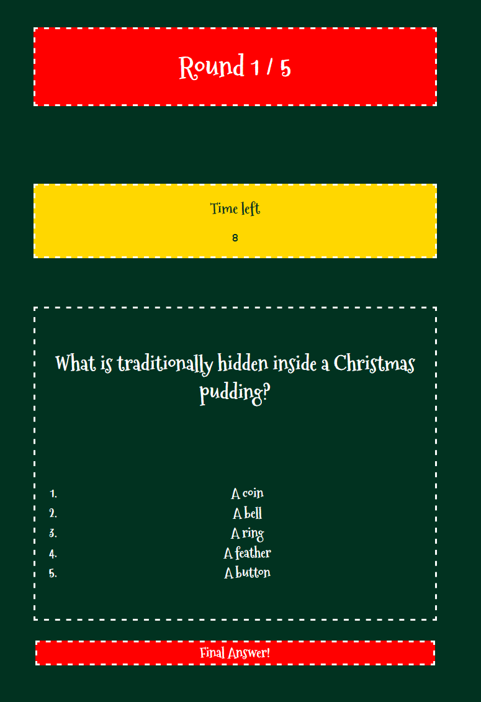

# The Christmas Quiz

#### **By Ffion Haf Edwards**
[Click here to view the live web application]()

This is the testing documentation for my web application: The Christmas Quiz. 

[Full README available here](README.md)

- - -
## Table of Contents
<!--> will insert TOC once document is completed <-->

## Introduction
Welcome to the testing documentation for "The Christmas Quiz". This document provides a comprehensive overview of the various testing methods and procedures employed to ensure the web application is robust, user-friendly, and functions seamlessly across a range of devices and browsers.

The primary objective of these tests is to guarantee that "The Christmas Quiz" delivers an engaging, interactive, and error-free experience to users, aligning with the project’s goals of educational entertainment and festive enjoyment. The testing process covers a multitude of aspects including functionality, usability, responsiveness, compatibility, and performance.

Each section of this documentation details specific tests conducted, methodologies used, outcomes observed, and any actions taken to address issues or enhance the user experience. By rigorously testing the application, high standards of quality and reliability were upheld, ensuring that "The Christmas Quiz" stands out as a premier choice for users seeking festive-themed interactive content. All the test results detailed below are based on the [deployed site]().

## Automated Checks and Validation

### HTML Validation

I subjected the HTML code of all the pages to validation using the [W3C HTML Validator](https://validator.w3.org/nu/).

#### **Errors**

Bad value for button attribute role on li

#### **HTML Validation Post-Fix**

HTML Validation index.html

HTML Validation game.html

HTML Validation results.html

### CSS Validation

I validated all CSS code in `style.css` using [W3C CSS Validator](https://jigsaw.w3.org/css-validator/#validate_by_input). 

#### **CSS Validation Result**

No validation errors were found. This is likely because VSCode has a [built-in CSS linter](https://code.visualstudio.com/docs/languages/css#_syntax-verification-linting)

CSS Jigsaw Validation Final Results

### JavaScript Validation
I used two methods to validate the JavaScript written. Firstly I used ESLint as it is the preffered industry standard for modern JavaScript linting and [integrates into VSCode via the ESLint extension](https://marketplace.visualstudio.com/items?itemName=dbaeumer.vscode-eslint) which gives feedback on JavaScript issues in real-time.

[A comparison in package downloads](https://npmcharts.com/compare/jshint,eslint) shows that ESLint has ~32M downloads whereas JSHint has ~400K for the same period. 

Microsoft itself even shows the JSLint extension for VSCode as deprecated

For the ESlint VSCode extension I used [AirBnB's Javascript Style Guide](https://github.com/airbnb/javascript) to adhere to good JavaScript practices. This can be seen in the `./assets/js/.eslintrc.js` file. Many issues were automatically flagged and fixed using this such as [no-use-before-define](https://eslint.org/docs/latest/rules/no-use-before-define) errors where I was calling a function before defining it.

Nevertheless, I also subjected the JavaScript code of all the pages to validation using [JSHint](https://jshint.com/) as it was used in previous course example case studies.

<!--> Insert details of any errors or warnings here <-->
#### **JavaScript Validation Pre-Fix**

Missing semicolons in all 3 files

There were missing semicolons in all my JS files.

Unused variables in loop forEach loops

In my forEach loops I was referencing an unused index in two occassions.

JSHint dot notation

JSHint picked up on a better style for accessing a property of an element.

#### **JavaScript Validation Post-Fix**

JavaScript Validation Final Index

JavaScript Validation Final Results

JavaScript Validation Final Results

### Accessibility

I ran the site through the [Wave Web Accessibility Evaulation Tool](https://wave.webaim.org/). You can [view the full report for the Christmas Quiz site](https://wave.webaim.org/report#/https://ffionhaf96.github.io/msp-2-christmas-quiz/) I created but I have also included key aspects of the report below.

#### Summary
No error were found and I encountered 4 alerts on initial testing, headers not using <hX> element and suspicious alt text which have been rectified. Manual testing was still encouraged by the WAVE tool.

#### **Accessibility Errors**

#### Possible headings alerts
As mentioned in the summary - 4 alerts were found with citing 3 possible headings that were not using heading elements. 

Possible headings alert

#### Suspicious alt text alert on results page
The last alert was aruond suspicious alt text for the images provided on the results page which was rectified by supplying unique alt text for each image via the `alt` key in the `resultsCategory` array in `questions.json`

Suspicious alt text in results.html

#### Contrast error found in Firefox devtools
Early in development in the `timer` section of the I was using white text on a bright yellow background which failed WCAG standards for accessible text. 

Failed accessible text

This was then amended to use a dark green from the sites color pallete which passes the contrast test.

Passing accessible text

#### **Wave Web Accessibility Results Post-Fix**

Wave Web Accessibility Final Results index.html

Wave Web Accessibility Final Results  game.html

Wave Web Accessibility Final Results results.html

### Performance
I utilized Google Chrome Dev Tools' Lighthouse to assess the performance of the site.

#### **Lighthouse Results**

Performance Emulation

All Mobile benchmarks in Chrome Dev Tool's Lighthouse were ran emulating a Moto G Power smartphone using Chromium 120.0.0.0 and a slow 4G network connection.

Desktop benchmarks did not have any emualtion applied.

Home Page

As this was the simplest page it was not particularly difficult to achieve a 100 lighthouse score. There is no data being fetched nor is there any big LCP or CLS to be concerned about because there is no dynamic elements.

*Home Page - Desktop*

*Home Page - Mobile*

Game Page

*Game Page - Desktop*

*Game Page - Mobile*

Results Page

*Results Page - Desktop*

*Results Page - Mobile*

404

*404 - Desktop*

*404 - Mobile*

## Manual Testing
### Testing User Stories

I conducted tests on the site in alignment with my defined user stories:

| No. | User Goal                   | How is it achieved?                                        |
|-----|-----------------------------|------------------------------------------------------------|
| 1   | Discover Festive Knowledge  | Participate in an online quiz to learn about Christmas traditions, history, and fun facts. |
| 2   | Engaging Visual Content     | View festive-themed images and graphics and colours throughout the quiz. |
| 3   | Understanding Quiz Results  | See a summary of quiz results to understand Christmas knowledge and preferences. |
| 4   | Multi-Device Accessibility  | Access the quiz on any device, ensuring a seamless experience. |
| 5   | Ease of Navigation          | Navigate the site easily, with a user-friendly interface for the quiz and additional content. |

**Screen Recordings/ Screenshots of User Stories**

User Story 1: Discover Festive Knowledge

s

User Story 2: Engaging Visual Content

A summary of the results includes christmas themed images generated using OpenAI's DALL-E v3.

Fun Christmas emojis can be chosen as an avatar for the Quiz which appears next a users nickname in the results page.

User Story 3: Understanding Quiz Results

The house rules modal is a quick and easy way for users to get situated with the light hearted and simple rules of the Christmas quiz.

https://github.com/Ffionhaf96/msp-2-christmas-quiz/assets/140890469/836290af-fdda-4c9d-8ee0-8ee1e11f1805

User Story 4: Multi-Device Accessibility

The quiz can be enjoyed no matter what device is being used whether it's a small smartphone screen

or a bigger screen like on a desktop monitor or laptop

User Story 5:  Ease of Navigation

The restart button allows for users to either midway through the quiz, restart and reach the beginning of the quiz. They can also accomplish this at the end once they receive their results.

https://github.com/Ffionhaf96/msp-2-christmas-quiz/assets/140890469/c63b57bb-deee-424c-aab2-a327339a3e47

- - -

### Feature Testing

#### **Responsiveness / Device Testing**

The site was tested on the following devices:
- Dell Precision 5530 - 2160p Screen
- Phillips Ultrawide 34" monitor - 1440p screen
- Samsung Galaxy S23 Ultra - 2160p screen
- Google Chrome Developer Tools - simulator for all different device options as well as using the adjustable sizing options

- - -
#### **Browser Compatibility**

The site was tested on the following browsers.
* Google Chrome
* Mozilla Firefox

### Feature Testing Results Table

#### Site Wide

| Feature            | Expected Outcome                                                                                | Testing Performed                                                                                                                       | Result                                                                       | Pass/Fail |
|--------------------|-------------------------------------------------------------------------------------------------|-----------------------------------------------------------------------------------------------------------------------------------------|------------------------------------------------------------------------------|-----------|
| Whole Page         | Layout is fully responsive                                                                      | Checked layout using dev tools to simulate multiple viewports of different devices. Tested on real devices with variable viewport size. | Page elements were responsive on all devices largely due to use of CSS Grid. | Pass      |
| Main Page Contents | Colors of elements are correctly matched to that of the color pallete defined in the README.md. | Manually checked browsers were displaying colors correctly and checked CSS variables were being used throughout for consistency.        | Content displayed as expected.                                               | Pass      |
| Favicon            | Appears in browser tab                                                                          | Checked browser tabs on multiple devices. Including saving as a shortcut on Android device via Samsung Browser.                         | Favicon appeared always.                                                     | Pass      |
| Console            | No debug statements are logged to console. Only caught errors such as failure to fetch data.    | Played through quiz and viewed browser console to manually confirm.                                                                     | No errors were found to be logged.                                           | Pass      |

#### Index Page
|                               |                                                                                                                                                                                |                                                                                                       |                                                                                                                                                                   |           |
|-------------------------------|--------------------------------------------------------------------------------------------------------------------------------------------------------------------------------|-------------------------------------------------------------------------------------------------------|-------------------------------------------------------------------------------------------------------------------------------------------------------------------|-----------|
| Feature                       | Expected Outcome                                                                                                                                                               | Testing Performed                                                                                     | Result                                                                                                                                                            | Pass/Fail |
| User can navigate to page     | A user can visit the [URL generated by deploying to GitHub pages](https://ffionhaf96.github.io/msp-2-christmas-quiz/index.html) and arrive at the Christmas Quiz start screen. | Navigating to the URL on multiple devices.                                                            | The index page is properly loaded and interactive.                                                                                                                | Pass      |
| Nickname Input                | A user should be able to input a nickname and save it. They should be notified if they have failed to perform or input an invalid name such as all spaces.                     | Input a name and saved it using the "save my nickname" button.                                        | The nickname is saved into localStorage.Empty spaces for a name results in an error message.                                                                      | Pass      |
| Avatar Selection              | A user can select one avatar from 5 preset emoji avatars and save their choice.                                                                                                | Every avatar was selected and ensured that it saved and appeared in the "Your current avatar" element | Avatars were correctly limited to only one, shown in the "your current avatar" element and stored in localStorage.                                                | Pass      |
| User can read the house rules | A user can click "House Rules" which informs them of the lighthearted rules of the quiz.                                                                                       | Clicking House Rules and making sure the modal loaded into view.                                      | Clicking the House Rules button loaded the Modal into the foreground of the page while disabling other elements.                                                  | Pass      |
| A user can start the quiz     | A user can start the quiz by clicking the "Let's get started" button.                                                                                                          | Clicking the lets get started button with the avatar and name inputs in various states.               | Clicking the let's get started button correctly notified the user they need to select an avatar or input a valid nickname or started the quiz if both were valid. | Pass      |

#### Quiz Page

- - -
## Bugs & Fixes

Throughout the development and testing phases, besides the enhancements mentioned in the validation section above, I came across the following bugs:

- Bug 1 - Storing Array objects directly in localStorage did not work
    - Fix - [Use `JSON.parse()` and `JSON.stringify()` to store an Array as a string](https://stackoverflow.com/questions/3357553/how-do-i-store-an-array-in-localstorage)

- Bug 2 - `chosenAnswers` key needed click event triggered twice to move onto next question
    - Fix - Originally incrementing values with postfix (`index++`) operation which returned value of index and then incremented. Changing to a prefix (`++index`) operation incremented and then returned the value which was intended behaviour.

- Bug 3 - Quiz countdown timer using `setInterval` was not restarting for each new question.
    - Fix: `startTimer()` was being started in two places instead of just one. Changed to start in only one.
    __see__: use `git --no-pager diff c1b48936f188e9c6e8c033edb6d53111fe63f2dc 1759283cac75f9a47233ffbe7f190dc8fde9814b -- game.js` to see the exact fix.

- Bug 4 - Bluring elements for modal to appear only visible by targetting `body` element made everything blurred.
    - Fix: For this I had to find how to select every element that was a `child` of `body` and then not apply a blur to the modal. Luckily there is a property you can access on an element called `child`. This then lead me to Bug 5. 

- Bug 5 - Trying to apply `.classList.add("blur-10");` to each element from `body` using the `child` property did not work.
    - Fix: The `child` property returns a HTMLCollection which is not iterable. So I had to find a way to convert HTMLCollection to an Array. I found a solution on StackOverflow that suggest using `Array.from(HTMLCollection)`. This worked well and enabled me to apply `.classList.add("blur-10");`

- Bug 6 - Passing an argument to function that handles click event made function immediately execute without click event which caused the  e.g. `houseRules.addEventListener('click', handleHouseRules(true)`
    - Fix: Passing the argument to the function via the [`bind`](https://developer.mozilla.org/en-US/docs/Web/JavaScript/Reference/Global_objects/Function/bind) method made the argument available to the function but didn't invoke a function call immediately.
    

- - -
### Known & Remaining Bugs
The details about any remaining bugs are provided in the information above. For more detail, click on the links below:

<!-->insert detail of any unresolved bugs <-->

- - -
- - -

[Go to README](README.md)
